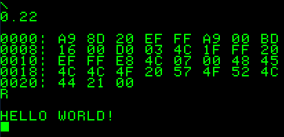

<h1 align="center">Hi 👋, I'm Naga Srinath</h1>

<h3 align="center">A linux enthusiast.</h3>

- `whoami`  A college student in India.

- `uptime`  16 years

- `pwd` India, Hyderabad

- `neofetch`   Arch Linux, DWM and Suckless Utilities

<h3 align="left">I am interested in:</h3>

		
		
		
		
		
		
		
		
		
		
		
		

<h3 align="left">My GitHub Stats:</h3>

